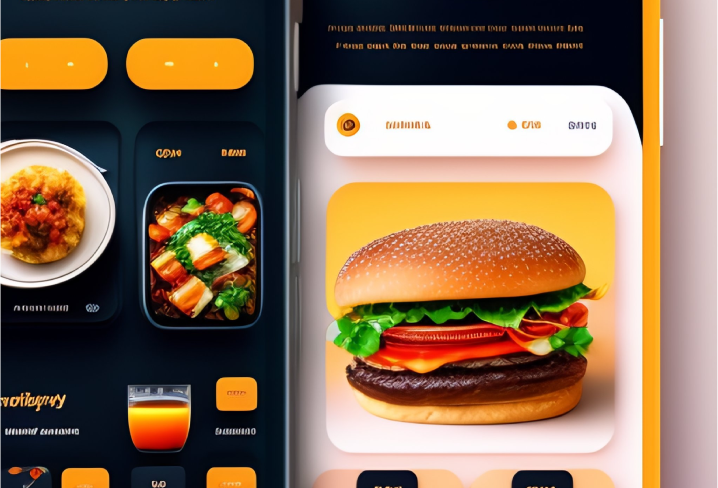

# :rocket: Sistema de Cardápio Digital

    

## :dart: Sobre

A solução de cardápio digital é perfeita para restaurantes e estabelecimentos de alimentos e bebidas que desejam aumentar sua conversão de vendas, taxa de retenção e oferecer uma experiência moderna e fácil de usar para seus clientes. Com nossa plataforma, os clientes podem navegar pelos cardápios digitais de forma rápida e fácil, encontrar os pratos que procuram e fazer pedidos de forma conveniente e segura.

Além disso, a solução de cardápio digital também ajuda a economizar tempo e recursos para os estabelecimentos, aumentando a eficiência e reduzindo os erros de comunicação. Onde não há necessidade de imprimir cardápios de papel caros e atualizá-los regularmente, pois os cardápios digitais podem ser atualizados em tempo real. Isso permite que os restaurantes sejam mais eficientes e ofereçam uma experiência mais personalizada para seus clientes.

Com a solução de cardápio digital os restaurantes podem se destacar da concorrência, oferecendo uma experiência moderna e conveniente que é a preferida dos clientes de hoje.

Com ele, você poderá:

> 1. Tornar seu atendimento 100% personalizado.
> 2. Customizar seu cardápio digital de acordo com as necessidades do seu negócio.
> 3. Entregar mais autonomia para clientes presencias com a opção de QR Code e montagem de pedidos totalmente personalizável.
> 4. Integrar o cardápio digital a nossa solução de atendimento automatizado.
> 5. Integrar o cardápio digital a nossa solução vendas totalmente on-line, Loja virtual(e-commerce).
> 6. Gerar relatórios com gráficos e tabelas que mostram métricas de pedidos e outros.

## Características gerais

1. **:bento: Cadastro de menu**
2. **:bookmark_tabs: Listagem de itens do menu**
3. **:wrench: Gerenciamento de menus e recursos**
4. **:art: Design(visual) personalizado**

## :factory: <a id="resources">Recursos</a>

> __:fire: <a id="essential-package">Pacote Essencial</a>__: Entrega uma boa experiência, fornecendo ao cliente toda comodidade de um cardápio digital bem como recursos essenciais para fechamento do pedido junto ao estabelecimento. [Detalhes de orçamento](#budget)

### Destaques

- Listagem de itens do menu: Incluindo imagem, nome, descrição e valor.
- Listagem organizada por categorias.
- Pagina com detalhes do menu/ou prato, como: Tamanho/quantidade ou porção e embalagem.

### Funcionalidades

- Menu de navegação por categoria.

### Usabilidade

- Design responsivo: Capacidade de adaptação a diferentes dispositivos e tamanhos de telas.
- Boa experiência(UX):  Capacidade de visualizar e interagir com a aplicação independentemente do dispositivo.

> __:fire: <a id="prime-package">Pacote Aprimorado</a>__: Torna a experiência do cliente com o Cardápio Digital mais rica, elevando o nível de satisfação, mitigando risco e aumentando a conversão de vendas, retenção de cliente e fidelidade. [Detalhes de orçamento](#budget)   

#### Contempla todos os recursos do [Pacote Essencial](#essential-package).

### Adicionais:

* __Sistema de paginação__
* __Filtros Combinados__
* __Busca__ 

#### Paginação:

- __Melhoria__: Performance, usabilidade e experiência do cliente(usuário).
- __Recurso__: Evita que a pagina fique muito longa e difícil de navegar(interações por rolagem), dado uma lista considerável de itens no cardápio.
- __Funcionalidade__: Cria-se uma divisão de itens por página, permitindo que o cliente navegue entre os itens com mais facilidade e rapidez.

#### Filtros:

> __Observação__: Todos os filtros podem ser usados de formas combinadas a nível de interação com cardápio digital e cada adição de um tipo de filtro agrega valor no pacote. [Detalhes de orçamento](#budget)

- __Melhoria__: Usabilidade e experiência do cliente(usuário).
- __Recurso__: Permite uma interação mais personalizada com a lista de itens do cardápio.
- __Funcionalidade__:

    > __Ordenação__: Menu suspenso, onde é possível selecionar ordem alfabética, menor e maior preço/valor e recomendados.   
    
    > __Seleção__: Caixas que podem ser selecionadas baseadas em categorias, por exemplo.
    
    > __Range de valor__: Campos/ou slider onde pode-se definir um range/intervalo de valor, sendo um mínimo/ou máximo.  

#### Busca:

- __Melhoria__: Performance, usabilidade e experiência do cliente(usuário).
- __Recurso__: Permite uma interação com maior granularidade/refinamento com a lista de itens do cardápio.
- __Funcionalidade__: Dado a uma entrada/digitação de um termo, leia-se letra/ou palava, no campo de busca, será mostrado apenas itens do cardápio que atendam o "termo" pesquisado/buscado.

> __:fire: <a id="prime-package">Pacote Ouro</a>__: Entrega uma ferramenta completa de gerenciamento do cardápio digital, como: Painel de administrador da plataforma, cadastro de dados do cardápio, sistema de carrinho e checkout de pedido, envio de pedido via e-mail/ou Whatsapp, realizar pedidos off-line(sem internet), sincronização de pedidos off-line(sem internet), relatórios e métricas de pedidos bem como gráficos, e registro/cadastro(login) de clientes(usuário) a plataforma. [Detalhes de orçamento](#budget) 

## :construction: <a id="budget">Prazos e Orçamento</a>

- Prazo de Entrega: De 30 a 180 dias a partir da assinatura do contrato.
- Orçamento: A ser definido com base nas necessidades específicas do sistema de Cardápio Digital. 

## :warning: <a id="terms">Termos e condições</a>

- O Software/sistema será fornecido via web
- O custo será determinado com base no tamanho e complexidade do sistema de Cardápio Digital.
- Pagamento: 30% no início do projeto e o restante na entrega, dado aprovação.
- Suporte técnico: garantido por 3 meses após a entrega do sistema.
- Garantia de funcionamento: garantida por 6 meses após a entrega do sistema.
- O Software/sistema é protegido por direitos autorais e é proibido o uso não autorizado.

Se você deseja uma solução de Cardápio Digital confiável e eficiente para seu estabelecimento, não hesite em entrar em contato conosco. Estamos aqui para ajudá-lo!
